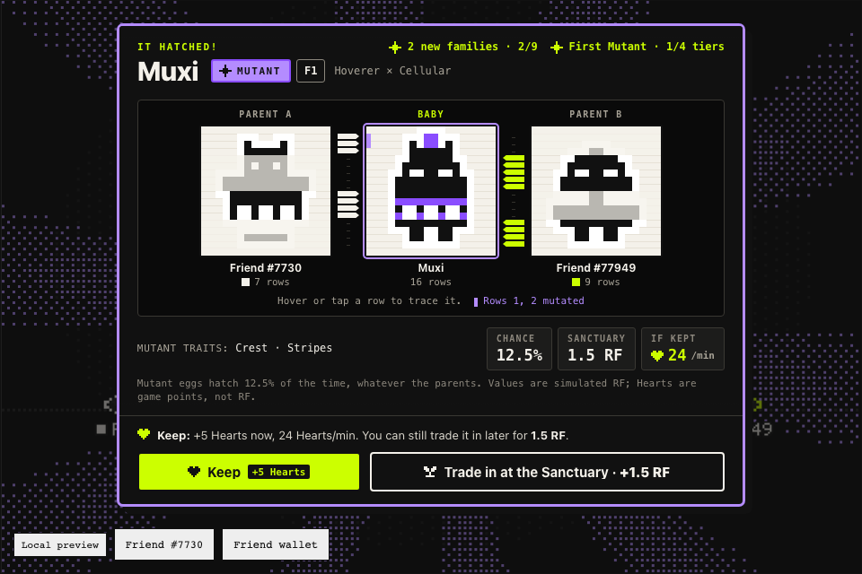
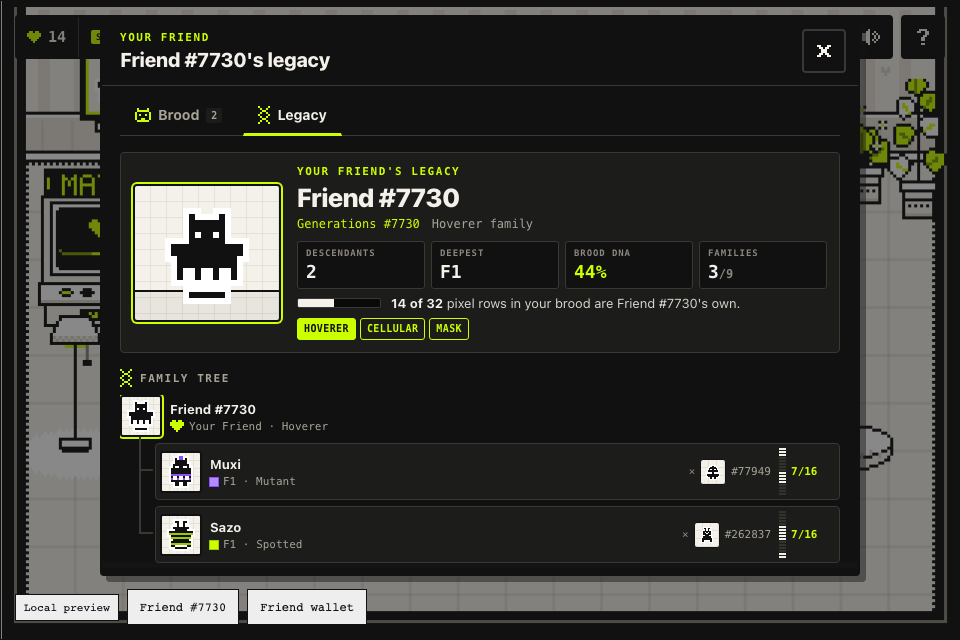

# Rare Breeds


*Demo capture from the SDK's automated test runtime; the tiers in this clip are scripted for the demo. In play, tiers follow the odds below.*

**Play: https://jlsjzn.github.io/friendsdk/**

**Project name**
Rare Breeds

**Builder / contact**
[@JLSJZN](https://github.com/JLSJZN) · X [@JLSJZN](https://x.com/JLSJZN) · Telegram [@JLSJZN](https://t.me/JLSJZN)

**Category**
Character Spotlight (primary) · Economy Potential (secondary)

**One sentence**
Your Friend's 256 on-chain pixels are its DNA: pair it with a real Rare Friend, hatch a 1 RF egg (simulated), and the baby inherits whole pixel rows from both parents, walk cycle included.

**Source code**
[GitHub repository](https://github.com/JLSJZN/friendsdk/tree/9c298d7/games/rare-breeds) (commit [`9c298d7`](https://github.com/JLSJZN/friendsdk/commit/9c298d7); latest on branch `rare-breeds`) · FriendSDK v0.1.2 (fork of `spokesz/friendsdk` at `762d6f5`) · React 19 · TypeScript · Canvas 2D · [game README](https://github.com/JLSJZN/friendsdk/blob/9c298d7/games/rare-breeds/README.md) · [exact rules: `game.json`](https://github.com/JLSJZN/friendsdk/blob/9c298d7/games/rare-breeds/game.json)

**Playable preview**
https://jlsjzn.github.io/friendsdk/ on GitHub Pages, built with the SDK CLI (`node tools/build-pages.mjs --base friendsdk`).

**Wallet and network**
A browser wallet on **Robinhood mainnet (chain 4663)** holding a hardwired Rare Friends Generations NFT, generation 1 or higher. The SDK runtime connects the wallet, lets you pick the Friend and verifies ownership at a fresh block before play. No RF, private key or transaction signature is needed: all balances and outcomes in the preview are simulated.

## Try it in 60 seconds

1. Open **https://jlsjzn.github.io/friendsdk/** in a browser with MetaMask or Rabby (or the wallet app's browser on a phone), connect, switch to Robinhood mainnet and pick your Friend. Nothing is signed or spent.
2. Click through the short intro (or **Skip intro**), then **Find a match** and pick one of three real Friends as the mate.
3. **Buy egg & breed · 1 RF** (simulated; confirm **Buy egg**, then **Use egg** in the SDK dialogs) and watch both parents' pixel rows merge into the baby. **Keep** it and it follows your Friend and earns Hearts for hats, trade it in at the Sanctuary, or launch it from the Moon Slingshot.

## How the NFT is the main character

- **You play as your Friend, and it is never recoloured.** Its 64 canonical frames (idle and walk, four facings, eight frames each) are read on-chain from the FamiliesRegistry through the SDK and drawn pixel for pixel at an integer scale, with a white sticker outline. The intro opens on your own Friend: 16 rows x 16 = 256 pixels per frame, and the genome spans all 64 frames.
- **Its pixels literally become the baby.** Each of the baby's 16 rows is copied from one parent, in runs of 2 to 5 rows (each parent gives at least 4). One row mask covers all 64 frames, so the baby walks with a real mix of both parents' walk cycles. Frames are repaired into one connected body with the fewest added pixels; no inherited pixel is ever removed, and symmetric parents give symmetric babies. The result card shows the DNA strip: which rows came from whom.
- **Hats sit on the canonical art, not over it.** Each hat is anchored to every frame's own head, so it bobs with the Friend's idle frames and walks with its walk cycle in all four facings, and it never covers a pixel of body ink. Tests check this on all 73 pool Friends and 32 bred babies (mutants, prismatics, Side-walkers, F2), 64 frames each.
- **The mates are real Friends too:** 73 Generations Friends from all nine families, with their canonical art.
- **Family genes carry over.** Colossus Friends have no front or back art, so **Side-walker** is dominant: any baby with a Colossus parent shows its right-facing frames from every side, and passes that on to F2 and F3.
- **Lineage.** A baby is one generation past its older parent (F1, F2, F3...), and every baby traces back to the holder's own Friend.

- **The Friend's legacy is tracked.** The Legacy card traces every row of every kept baby back to its founder: it shows how many of the brood's pixel rows are still the holder's Friend's own, across F1, F2 and F3.

| DNA card | Your Friend's legacy |
| --- | --- |
|  |  |


## How to play

Walk with **WASD** / arrow keys, or tap and drag on the floor. Press **E** (or Enter, Space, or tap the station) at a station. A six-step intro explains the game on start (what it is, the four stations on a picture of the room, breeding, the odds, what to do with a baby, every HUD chip); **?** replays it and shows the stations and HUD legends, the odds, mute and reduced motion.

1. **Matchmaker:** parent A is your Friend (or a kept baby); parent B is one of three real wild Friends (free reroll, or a 15-Heart **Wish** for a family you pick) or another kept baby.
2. **Breed:** uses one Egg. With none waiting, **Buy egg & breed · 1 RF** buys one first. The runtime asks you to confirm **Buy egg**, then **Use egg**.
3. **Hatch:** the mate walks in, the egg wobbles and cracks, both parents' rows fly in and merge, the baby appears (**Skip** or Escape to jump ahead).
4. **Keep or trade in:** **Keep** adds the baby to your brood (+5 Hearts, then Hearts every 10 s); it follows you around the nursery in a line. **Trade in at the Sanctuary** redeems it for its fixed value (runtime confirmation **Redeem reward**).
5. **Spend Hearts and breed again:** tap the heart counter for hats and wishes. Kept babies are parents too: F1 babies make F2, F2 make F3. Goal: babies from all 9 families and all 4 tiers.

The Egg incubator sells 1, 3 or 5 eggs in one confirmation. The **Moon Slingshot** (in front of the back window, between the incubator and the Sanctuary) launches a kept baby: pick one, hold to pull the band (Space or Enter held on the keyboard; a tap works too), let go and confirm **Redeem reward**. The baby is traded in for its fixed value (into the balance as usual), shot out through the window, and where it lands multiplies that value from x0 to x10 (simulated); a result card shows payout, stake and net and where each went, and the HUD keeps the session's Slingshot net in its own pill (simulated, not spendable in the preview). The baby is gone afterwards, even in the pond. Everything stays inside the SDK's container; on portrait phones the frame is 3:4 with a follow camera.

## Features

- **Pixel genetics:** every baby is built from its two parents' real pixel rows across all 64 frames, with a pattern and mutation per tier. Deterministic from (Friend ID, parents, play ID).
- **Brood and lineage:** kept babies follow your Friend like ducklings and can breed with wild Friends or each other (F1, F2, F3). Colossus passes on a dominant Side-walker gene.
- **Hearts:** session game points that only kept babies earn (6 to 60 a minute by tier, +5 per Keep). Never RF, never redeemable.
- **Hearts shop:** 8 hats from 20 to 250 Hearts that sit on each Friend's own head, frame by frame, and a Wish match for 15 Hearts.
- **Collection goal:** all 9 Friend families and all 4 tiers, tracked on the reveal card and in the brood.
- **Moon Slingshot:** a fourth station that turns a kept baby into a jackpot shot. Hold to pull, let go: the SDK trades the baby in (runtime-confirmed `redeem`, its fixed value becomes the stake), the baby flies out through the window, and six landing zones from a belly flop in the pond (x0) to the Moon (x10) multiply the stake, 0.9x on average. The multiplier is a clearly labelled simulated side ledger backed by a 600 RF Moon Fund; how hard you pull is cosmetic.
- **Onboarding:** a six-step intro with your own Friend: what the game is, your nursery (the real room art with the four stations numbered), breeding, the odds, Keep / Sanctuary / Moon Slingshot, and a legend of every HUD chip ending on the goal and the first tap. Plus first-time hints, a "What can hatch" odds strip in the Matchmaker, and **Replay intro**.
- **Phone layout:** a 3:4 portrait frame (`host.css`) and a follow camera on small frames.
- **DNA card:** every reveal shows parent A, the baby and parent B side by side at the same scale on one 16-row grid; hover or tap a row to trace where it came from (your Friend's rows paper white, the mate's rows green, mutated rows marked).
- **Your Friend's legacy:** a card for the holder's Friend (descendants, deepest generation, the share of the brood's pixel rows that are still its own, families mixed in) and a family tree rooted at it. Tap the Friend in the nursery to open it.
- **Less friction on repeat play:** fresh wild mates after every hatch with one from an uncollected family preselected, a "Stock up: 5 eggs" button (one confirmation), and a 1.8 s hatch cut after the first two (Mutant and Prismatic keep the full show).

## Costs, odds and rewards

**All balances, purchases and rewards are simulated.** You start with 20 RF; the preview ledger holds 60 RF of simulated prize backing (6 RF maximum prize x 10). One Egg costs **1 RF** (`1000000000000000000` base units) and hatches exactly one baby.

| outcomeId | Tier | Weight | Chance | Sanctuary value | EV share | Hearts if kept |
| ---: | --- | ---: | ---: | ---: | ---: | ---: |
| 1 | Common hatchling: pure ink rows | 6,000 bps | 60% | 0.5 RF | 0.3 RF | 6 / min |
| 2 | Spotted hatchling: green pattern | 2,500 bps | 25% | 1 RF | 0.25 RF | 12 / min |
| 3 | Mutant hatchling: violet pattern plus a head mutation | 1,250 bps | 12.5% | 1.5 RF | 0.1875 RF | 24 / min |
| 4 | Prismatic hatchling: rainbow body, mutation and tail | 250 bps | 2.5% | 6 RF | 0.15 RF | 60 / min |

- Expected value: (0.5 x 6000 + 1 x 2500 + 1.5 x 1250 + 6 x 250) / 10000 = **0.8875 RF per egg** (88.75% return, 11.25% house edge), exact over all 10,000 rolls.
- Backing follows the SDK unchanged: every purchased or pending egg reserves the 6 RF maximum prize; kept babies keep their fixed value reserved with no redemption expiry; new purchases stop when free stake cannot cover another maximum prize. From the preview stake that happens only after 11 Prismatic hatches in a row (p = 2.38e-18).
- The parents never change the odds. The tier comes from the ledger; the parents only decide what the baby looks like.
- From 20 RF: keeping every baby gives exactly 20 hatches; trading in every baby gives at least 39 (mean 173.7 over 5,000 simulated sessions). P(at least one Prismatic in 20 hatches) = 39.7%.

**Hearts (game points, not RF).** Earned by kept babies once per 10 s cycle (Common 1, Spotted 2, Mutant 4, Prismatic 10), +5 on every Keep; an average kept baby earns 0.6 x 6 + 0.25 x 12 + 0.125 x 24 + 0.025 x 60 = 11.1 a minute. Spent on hats (Party hat 20, Bow 20, Flower 25, Beanie 35, Headphones 50, Top hat 80, Crown 150, Halo 250; 630 for all) and the Wish match (15). Hearts cannot be bought with RF, traded in or redeemed, so they back no payout and need no prize reserve. They last for the session.

**Moon Slingshot (simulated side ledger).** A launch first trades the baby in through the SDK (`redeem(outcomeId, 1)`, runtime confirmation **Redeem reward**): the tier token is burned and its fixed value, the stake, lands in the simulated RF balance. Then one roll in 0-9999 picks the landing zone, and the side ledger books only the difference, payout minus stake, as **Slingshot net** (can be negative).

| Zone | Rolls | Weight | Chance | Multiplier | Prismatic (6 RF stake) pays |
| --- | --- | ---: | ---: | ---: | ---: |
| Belly flop in the pond | 0-3999 | 4,000 bps | 40% | x0 | 0 RF |
| Haystack | 4000-6399 | 2,400 bps | 24% | x0.5 | 3 RF |
| Rooftop | 6400-8199 | 1,800 bps | 18% | x1 | 6 RF |
| Cloud nine | 8200-9399 | 1,200 bps | 12% | x2 | 12 RF |
| Orbit | 9400-9799 | 400 bps | 4% | x4 | 24 RF |
| The Moon | 9800-9999 | 200 bps | 2% | x10 | 60 RF |

- Expected payout: (0.5 x 2400 + 1 x 1800 + 2 x 1200 + 4 x 400 + 10 x 200) / 10000 = **x0.9 of the stake** (10% edge, the same as the SDK fishing reference), exact over all 10,000 rolls: 0.45 / 0.9 / 1.35 / 5.4 RF per launch for Common / Spotted / Mutant / Prismatic. Launching every baby returns 0.8875 x 0.9 = **0.79875 RF per 1 RF egg** (`798750000000000000` base units).
- Backing mirrors the SDK rule: the simulated Moon Fund starts at **600 RF** (10 x the 60 RF top payout, the SDK preview-stake convention), and a baby worth v flies only while the fund covers its x10 payout. The fund takes the stake and pays the payout (fund' = fund + v - payout >= v), so it never goes negative; the first 11 launches of a session can never be blocked, and in 5,000 simulated sessions that launch every baby it never blocked a launch (lowest point 421 RF).
- The zone is drawn once, after the trade-in is confirmed; no reroll, every result final. How hard you pull is cosmetic. Cancelling the confirmation changes nothing.
- A session that launches every baby (5,000 simulated sessions from 20 RF, the trade-ins paying for new eggs): 173.7 launches on average, P(at least one Moon landing) = 92.5%, mean Slingshot net -15.578 RF on a mean stake of 154.236 RF (the exact identity is E[net] = -0.1 x E[staked]), P(net > 0) = 24.0%.

Full tables, base units and the Monte Carlo: [Rules and rewards](https://github.com/JLSJZN/friendsdk/blob/9c298d7/games/rare-breeds/README.md#rules-and-rewards-rf-simulated) · [Moon Slingshot](https://github.com/JLSJZN/friendsdk/blob/9c298d7/games/rare-breeds/README.md#moon-slingshot-simulated-side-ledger) · `node tools/economy-report.mjs`.

## Economy Potential

**Today (simulated, SDK `ChanceGame` unchanged): two currencies with a hard line between them.**

- **RF, backed:** spent in exactly one place, Eggs at 1 RF. Every baby needs a new egg, and lineage asks for more: an F3 takes at least three hatches, each with fresh odds. A kept baby keeps its fixed RF value reserved inside the game until its holder trades it in. The 11.25% average house edge stays in the game contract as free stake; it is not burned.
- **Hearts, unbacked game points:** earned only by holding babies, spent only on hats and Wish matches. Nothing Hearts buy is redeemable, so they create no RF liability and need no reserve.

The two connect at the reveal card: fixed RF now, or Hearts over time plus a parent for the next generation. Rarer babies are worth more both ways (0.5 to 6 RF, or 6 to 60 Hearts a minute). Hearts never replace RF: a Wish picks a better mate, but the hatch still needs an egg.

**A second RF loop on bred babies: the Moon Slingshot (simulated multiplier).** Breed, keep, launch: every kept baby is also a stake. The trade-in runs through the SDK unchanged (`redeem`, backed, no expiry), and the slingshot puts that value back at risk on six zones from x0 to x10. Every launch returns on average 0.9x its stake; the 10% edge stays in the Moon Fund, which is always funded for the next x10 payout. It turns every hatch into a jackpot ticket: a Prismatic on the Moon pays 60 RF from a 1 RF egg (1 in 2,000 eggs: 2.5% x 2%; in the preview that is the 6 RF trade-in into the balance plus 54 RF of simulated net booked as **Slingshot net**), and a session that launches every baby lands on the Moon at least once 92.5% of the time. Live, each launch would be its own on-chain RF action (tier token burn, Dice request, RF payout to the Friend's canonical wallet), a spending loop that keeps bred babies moving RF after the hatch; no Token Activity metrics are claimed.

**Why breeding.** Breeding is one of the longest-running NFT spending loops: CryptoKitties (2017) charged a fee for every breed and let owners rent out Kitties as sires. Rare Breeds uses each Friend's own on-chain art as its genome, so every Friend brings genes no other Friend has.

**Future work, not built.** Illustrative numbers; each needs SDK and contract support (see below). Nothing is burned or paid to other holders today, and Hearts stay game points in every row.

| Mechanic | Player pays | Where the RF goes | Egg edge |
| --- | ---: | --- | ---: |
| Today: one egg | 1 RF | Game contract, prizes backed from stake | 0.1125 RF |
| Sire fee: breed with another holder's opted-in Friend | 1.25 RF | 0.25 RF to the sire Friend's canonical wallet | 0.1125 RF |
| Generational fee: F2 and later eggs | 1.25 RF | 0.25 RF burned at purchase | 0.1125 RF |
| Burn share on every egg | 1 RF | 0.05 RF burned at purchase | 0.0625 RF |
| RF cosmetics: e.g. a 1 RF hat next to the Hearts ones | 1 RF | Burned; no payout, so no reserve | unchanged |

A sire market would turn every holder's Friend into an RF-earning asset: its art becomes breeding stock that others pay to use. Cosmetics sold for RF would be a pure sink, and hats already sit on each Friend's own art. The 6 RF per egg backing is unchanged in every row.

## What would be on-chain

Nothing in this build; no transaction is ever sent and no contract is deployed. **The egg loop needs no new contract:** it is a deployment of the SDK's existing `ChanceGame` with this `game.json` (consumable Egg, four outcomes), used through the SDK's live runtime from the Friend's canonical wallet. **The Moon Slingshot needs one more contract** (future work, below).

| In the game | SDK action | Existing `ChanceGame` effect |
| --- | --- | --- |
| Buy eggs | `buy(quantity)` | Exact RF approval; RF moves from the Friend's canonical wallet into the game; 6 RF reserved per egg; Egg tokens minted to that wallet |
| Breed | `play(1)` | Burns one Egg and commits the play. No outcome exists yet |
| Hatch | `settle(playId)` | One Dice randomness request per batch (fee capped at 0.000025 ETH excluding gas), then `roll = keccak256(word, game, chainId, batchId, playId) % 10000` against the cumulative weights; mints one tier token (ERC-1155 id 1 to 4) to the Friend's canonical wallet |
| Keep | none | The tier token stays in the Friend wallet, backed, no expiry |
| Trade in at the Sanctuary | `redeem(outcomeId, 1)` | Burns one tier token and pays its fixed RF to the Friend's canonical wallet |

**Moon Slingshot: a separate `Slingshot` contract next to the `ChanceGame` (future work, not built, not deployed).** It needs the SDK support listed below.

| In the game | Preview today | Future `Slingshot` contract |
| --- | --- | --- |
| Launch | `redeem(outcomeId, 1)` (runtime-confirmed; tier token burned, fixed value to the simulated balance as the stake) | `launch(outcomeId)`: burns one tier token from the Friend's canonical wallet (or accepts it as the stake); its reserved value moves from the `ChanceGame` reward liability into the slingshot stake; reserves 10 x the value of free slingshot stake at launch time; requests one Dice random word. No outcome exists yet |
| Land | One browser roll (`samplePreviewRoll`); the simulated side ledger books payout minus stake | `settle(launchId)`: `roll = keccak256(word, game, chainId, launchId) % 10000` against the cumulative zone weights; pays value x multiplier in RF to the Friend's canonical wallet from the slingshot stake and releases the reservation |
| Pending launch | none (the roll follows the confirmation immediately) | Resumes by its launch ID; never burns another token, never rerolls |

On-chain: RF, Eggs, tier tokens, backing and every tier; live, also every slingshot launch, zone and payout. Off-chain: the baby's pixels (derived deterministically from Friend ID, parent A, parent B and play ID; genetics receives the settled tier as an input and cannot choose or change it), Hearts, hats, the collection and the flight animation. In the preview, the slingshot multiplier is a simulated local side ledger.

## How randomness is used

Two random outcomes carry RF value: the tier and the slingshot's landing zone. For the tier, the preview's SDK ledger draws one roll per settle; live, it comes from Dice as above: the Egg is burned before any randomness exists, there is no reroll, and an unsettled play resumes as **Finish hatching** without using another egg. The slingshot zone is drawn once, after the trade-in is confirmed. In the preview that roll is browser randomness: the SDK's own `samplePreviewRoll` (Web Crypto, rejection sampling to 0-9999), the same draw the preview ledger uses for eggs, and its result is a simulated local balance, which the SDK rules treat as presentation only. Live, it would come from the `Slingshot` contract's Dice request: the tier token is burned before any randomness exists, no reroll, and a pending launch resumes by its ID. How hard you pull the band only changes the animation. The baby's rows, pattern, mutation and name come from a seeded generator, so the same pair and play always give the same baby. The three wild Friends offered (also after a Wish) and idle animations are browser-random with no RF value; the "chemistry" hearts are flavour ("Same odds for every pair").

## Needs future SDK support

- **Persistence:** a per-Friend save for the brood, lineage, chosen pairs, Hearts, hats and the collection (the sandbox has no storage and the bridge no save API).
- **Pair commitment:** recording the parent pair with the play, so a baby's look can be rebuilt from chain state.
- **Sire market:** opt-in sire listings, RF payment to another Friend's canonical wallet, and runtime sprite reads of listed Friends. SDK v0.1.2 has no trading, revenue-share or creator-fee actions.
- **More consumables and RF sinks:** generation-priced eggs, a burn share at purchase, and RF purchases of cosmetics (one consumable, no upgrade or cosmetic action and no burn path today).
- **Unique baby tokens:** today's tier tokens are fungible per tier; minting each baby as its own NFT needs a minting API.
- **Moon Slingshot:** a second outcome table whose stake is a reward token (or reward-token-as-stake actions over the bridge, e.g. `launch(outcomeId)` and its settle), its own Dice request and pending-launch recovery, a way to move a kept reward's reserved value from the `ChanceGame` liability into the slingshot stake, and runtime confirmations for a launch. SDK v0.1.2 has one consumable and one outcome table, so the preview uses `redeem` plus a simulated side ledger for the multiplier.

## Run it

Node.js 22.18+ on macOS, Linux or Ubuntu/WSL2:

```sh
git clone https://github.com/JLSJZN/friendsdk.git
cd friendsdk
git checkout 9c298d7
npm ci
npm run build
node scripts/dev-game.mjs dev games/rare-breeds
```

Open the printed URL, connect the wallet and select your Friend. Add `--host 0.0.0.0 --port 4173` to play from a phone wallet browser on the same network.

## Checks

All run on commit `9c298d7` (FriendSDK v0.1.2, Node 22.18, macOS).

- [x] Unit tests `node --test "games/rare-breeds/tests/*.test.ts"`: **57 of 57 pass** (economy 14: schema, weights, exact EV, roll boundaries, backing and pause limits, hatch budget; genetics 13: determinism, 500 random pairs x 4 tiers give one connected body in all 64 frames, inherited rows never removed, symmetry, Side-walker through F2, tier effects, F2/F3 family labels, speed; accessories 8: every hat on every pool Friend and bred baby in all 64 frames stays in bounds, never on ink, follows the head; legacy 6: row origins traced to the founder at pixel level, descendants, generations, cycle safety; slingshot 16: zone odds over all 10,000 rolls, exact payouts per tier, x0.9 per launch, the Moon Fund and its backing rule, the same verdicts as the SDK's own preview ledger)
- [x] Typecheck `npx tsc -p games/rare-breeds/tsconfig.json` and the dev harness: clean
- [x] Game validation `node scripts/dev-game.mjs check games/rare-breeds`: valid (expected reward 0.8875 RF, maximum prize 6 RF)
- [x] Browser test `node tools/test-game.mjs`, 960 x 800 desktop: PASS
- [x] Browser test, 390 x 844 phone with touch: PASS
- [x] GitHub Pages build `node tools/build-pages.mjs --smoke --base friendsdk`: PASS, deployed from `9c298d7`
- [x] Hosted preview loads the SDK wallet gate with no console errors
- [ ] Real-wallet playthrough: the builder connected Rabby on desktop, Friend #77949 (generation 4) passed the SDK ownership check and the game loaded; a full desktop and phone playthrough with a real wallet is still to be reported here

The browser test drives the real sandboxed runtime and its confirmations: the six intro steps, two full hatch loops (Spotted and Prismatic kept, +5 Hearts each), buying the Party hat once the brood has earned 20 Hearts and putting it on the Friend, then trading in the Prismatic (balance 20 - 1 - 1 + 6 = 24 RF). Then the Moon Slingshot with the kept Spotted (desktop taps the station in the world, the phone uses the first-time prompt): a cancelled **Redeem reward** changes nothing, a confirmed one (1 RF) starts the flight, **Skip**, the result card shows payout, stake and net, and afterwards the brood is empty, the balance is 25 RF and the HUD shows the Slingshot net. It uses the SDK's mock wallet and sample Friend #7730; mocks are never in a build.

| Intro: your nursery | Hearts shop | Phone |
| --- | --- | --- |
|  |  |  |

| Moon Slingshot | Launch result | Phone slingshot |
| --- | --- | --- |
|  |  |  |

## Known limitations and risks

- **Session-local:** reloading starts a new session (20 RF, 0 Hearts, no hats, empty brood and collection). If only the game frame reloads, kept babies are rebuilt from the ledger with a deterministic stand-in mate, so their look and generation can change.
- **Wild mates are a fixed snapshot** of 73 Friends. Their holders are not involved and earn nothing in this build.
- **On-chain, the baby is a tier token.** Its pixels are presentation until the pair is recorded with the play. Hearts and hats are local game state.
- **Moon Slingshot multiplier is simulated:** a browser roll and a local side ledger (Moon Fund, Slingshot net), labelled simulated in the game. It resets when the game frame remounts (for example after switching Friends and back); the traded-in stakes stay in the runtime ledger like any Sanctuary redemption. Live play needs the `Slingshot` contract above, which is not built.
- **Wallets and funds:** game code never receives a wallet, signer or RF; the SDK runtime owns connection, eligibility and every confirmation. The preview sends no transactions. Live mode has never run and no contract is deployed.
- Every buy, use and redeem opens a runtime confirmation by design; on a phone it covers most of the frame.
- No trading, wearable NFTs, creator fees or live economy. No Token Activity metrics are claimed. Production publication needs separate Rare Friends review.

## Credits

Character art: canonical Rare Friends Generations sprites from the FamiliesRegistry (`0x246E3E9730A7Eade94c79be0Fd78d210f89AEb8D`, chain 4663); your Friend is read live through the SDK, the 73 wild mates are a snapshot taken with `tools/fetch-wild-friends.mjs`, and babies are derived from those pixels. Sounds: FriendSDK sound kit. Wallet, Friend selection, ownership gate, simulated ledger and confirmations: FriendSDK v0.1.2 runtime (Apache-2.0, [notices](https://github.com/JLSJZN/friendsdk/blob/9c298d7/NOTICE.md)). Nursery, stations, hatch effects, hats, icons and pixel lettering are drawn in code: no image, font or audio files and no third-party assets. Breeding as a mechanic is a nod to CryptoKitties; no assets or code are used.
