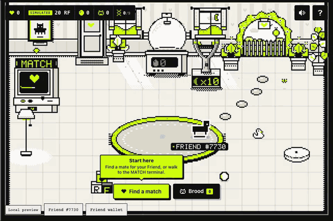

# Rare Breeds



*Demo capture from the SDK's automated test runtime; the Mutant and Prismatic tiers in this clip are scripted for the demo. In play, tiers follow the odds below.*

**Play: https://jlsjzn.github.io/friendsdk/**

**Project name**
Rare Breeds

**Builder / contact**
GitHub [@JLSJZN](https://github.com/JLSJZN) · X [@JLSJZN](https://x.com/JLSJZN) · Telegram [@JLSJZN](https://t.me/JLSJZN) · prize wallet `0xe3Ae2aed450D03F0160E6bE6aa0DFfF64b052fE8`

**Category**
Character Spotlight (primary) · Economy Potential (secondary)

**One sentence**
Your Friend's 256 on-chain pixels are its DNA: pair it with a real Rare Friend, hatch a 1 RF egg (simulated), and the baby inherits whole pixel rows from both parents, walk cycle included.

**Source code**
[GitHub repository](https://github.com/JLSJZN/friendsdk/tree/rare-breeds/games/rare-breeds) (branch `rare-breeds`; the checks below ran on commit [`b1c11e7`](https://github.com/JLSJZN/friendsdk/commit/b1c11e7)) · FriendSDK v0.1.2 (fork of `spokesz/friendsdk` at `762d6f5`) · React 19 · TypeScript · Canvas 2D · [game README](https://github.com/JLSJZN/friendsdk/blob/rare-breeds/games/rare-breeds/README.md) · [exact rules: `game.json`](https://github.com/JLSJZN/friendsdk/blob/rare-breeds/games/rare-breeds/game.json)

**Playable preview**
https://jlsjzn.github.io/friendsdk/ on GitHub Pages, built with the SDK CLI (`node tools/build-pages.mjs --base friendsdk`).

**Wallet and network**
A browser wallet on **Robinhood mainnet (chain 4663)** holding a hardwired Rare Friends Generations NFT, generation 1 or higher. The SDK runtime connects the wallet, lets you pick the Friend and verifies ownership at a fresh block before play. No RF, private key or transaction signature is needed: all balances and outcomes in the preview are simulated.

## Try it in 60 seconds

1. Open **https://jlsjzn.github.io/friendsdk/** in a browser with MetaMask or Rabby (or the wallet app's browser on a phone), connect, switch to Robinhood mainnet and pick your Friend. Nothing is signed or spent.
2. Click **Next** through the short intro (or **Skip intro**), then **Find a match** and pick one of three real Friends as the mate.
3. **Buy egg & breed · 1 RF** (simulated; confirm **Buy egg**, then **Use egg** in the SDK dialogs) and watch both parents' pixel rows merge into the baby. **Keep** it and it follows your Friend and earns Hearts for hats, or trade it in at the Sanctuary.

## How the NFT is the main character

- **You play as your Friend, and it is never recoloured.** Its 64 canonical frames (idle and walk, four facings, eight frames each) are read on-chain from the FamiliesRegistry through the SDK and drawn pixel for pixel at an integer scale, with a white sticker outline. The intro opens on your own Friend: 16 rows x 16 = 256 pixels per frame, and the genome spans all 64 frames.
- **Its pixels literally become the baby.** Each of the baby's 16 rows is copied from one parent, in runs of 2 to 5 rows (each parent gives at least 4). One row mask covers all 64 frames, so the baby walks with a real mix of both parents' walk cycles. Frames are repaired into one connected body with the fewest added pixels; no inherited pixel is ever removed, and symmetric parents give symmetric babies. The result card shows the DNA strip: which rows came from whom.
- **Hats sit on the canonical art, not over it.** Each hat is anchored to every frame's own head, so it bobs with the Friend's idle frames and walks with its walk cycle in all four facings, and it never covers a pixel of body ink. Tests check this on all 73 pool Friends and 32 bred babies (mutants, prismatics, Side-walkers, F2), 64 frames each.
- **The mates are real Friends too:** 73 Generations Friends from all nine families, with their canonical art.
- **Family genes carry over.** Colossus Friends have no front or back art, so **Side-walker** is dominant: any baby with a Colossus parent shows its right-facing frames from every side, and passes that on to F2 and F3.
- **Lineage.** A baby is one generation past its older parent (F1, F2, F3...), and every baby traces back to the holder's own Friend.


## How to play

Walk with **WASD** / arrow keys, or tap and drag on the floor. Press **E** (or Enter, Space, or tap the station) at a station. A four-step intro explains the game on start; **?** replays it and shows the odds, mute and reduced motion.

1. **Matchmaker:** parent A is your Friend (or a kept baby); parent B is one of three real wild Friends (free reroll, or a 15-Heart **Wish** for a family you pick) or another kept baby.
2. **Breed:** uses one Egg. With none waiting, **Buy egg & breed · 1 RF** buys one first. The runtime asks you to confirm **Buy egg**, then **Use egg**.
3. **Hatch:** the mate walks in, the egg wobbles and cracks, both parents' rows fly in and merge, the baby appears (**Skip** or Escape to jump ahead).
4. **Keep or trade in:** **Keep** adds the baby to your brood (+5 Hearts, then Hearts every 10 s); it follows you around the nursery in a line. **Trade in at the Sanctuary** redeems it for its fixed value (runtime confirmation **Redeem reward**).
5. **Spend Hearts and breed again:** tap the heart counter for hats and wishes. Kept babies are parents too: F1 babies make F2, F2 make F3. Goal: babies from all 9 families and all 4 tiers.

The Egg incubator sells 1, 3 or 5 eggs in one confirmation. Everything stays inside the SDK's container; on portrait phones the frame is 3:4 with a follow camera.

## Features

- **Pixel genetics:** every baby is built from its two parents' real pixel rows across all 64 frames, with a pattern and mutation per tier. Deterministic from (Friend ID, parents, play ID).
- **Brood and lineage:** kept babies follow your Friend like ducklings and can breed with wild Friends or each other (F1, F2, F3). Colossus passes on a dominant Side-walker gene.
- **Hearts:** session game points that only kept babies earn (6 to 60 a minute by tier, +5 per Keep). Never RF, never redeemable.
- **Hearts shop:** 8 hats from 20 to 250 Hearts that sit on each Friend's own head, frame by frame, and a Wish match for 15 Hearts.
- **Collection goal:** all 9 Friend families and all 4 tiers, tracked on the reveal card and in the brood.
- **Onboarding:** a four-step intro with your own Friend, first-time hints, a "What can hatch" odds strip in the Matchmaker, and **Replay intro**.
- **Phone layout:** a 3:4 portrait frame (`host.css`) and a follow camera on small frames.

## Costs, odds and rewards

**All balances, purchases and rewards are simulated.** You start with 20 RF; the preview ledger holds 60 RF of simulated prize backing (6 RF maximum prize x 10). One Egg costs **1 RF** (`1000000000000000000` base units) and hatches exactly one baby.

| outcomeId | Tier | Weight | Chance | Sanctuary value | EV share | Hearts if kept |
| ---: | --- | ---: | ---: | ---: | ---: | ---: |
| 1 | Common hatchling: pure ink rows | 6,000 bps | 60% | 0.5 RF | 0.3 RF | 6 / min |
| 2 | Spotted hatchling: green pattern | 2,500 bps | 25% | 1 RF | 0.25 RF | 12 / min |
| 3 | Mutant hatchling: violet pattern plus a head mutation | 1,250 bps | 12.5% | 1.5 RF | 0.1875 RF | 24 / min |
| 4 | Prismatic hatchling: rainbow body, mutation and tail | 250 bps | 2.5% | 6 RF | 0.15 RF | 60 / min |

- Expected value: (0.5 x 6000 + 1 x 2500 + 1.5 x 1250 + 6 x 250) / 10000 = **0.8875 RF per egg** (88.75% return, 11.25% house edge), exact over all 10,000 rolls.
- Backing follows the SDK unchanged: every purchased or pending egg reserves the 6 RF maximum prize; kept babies keep their fixed value reserved with no redemption expiry; new purchases stop when free stake cannot cover another maximum prize. From the preview stake that happens only after 11 Prismatic hatches in a row (p = 2.38e-18).
- The parents never change the odds. The tier comes from the ledger; the parents only decide what the baby looks like.
- From 20 RF: keeping every baby gives exactly 20 hatches; trading in every baby gives at least 39 (mean 173.7 over 5,000 simulated sessions). P(at least one Prismatic in 20 hatches) = 39.7%.

**Hearts (game points, not RF).** Earned by kept babies once per 10 s cycle (Common 1, Spotted 2, Mutant 4, Prismatic 10), +5 on every Keep; an average kept baby earns 0.6 x 6 + 0.25 x 12 + 0.125 x 24 + 0.025 x 60 = 11.1 a minute. Spent on hats (Party hat 20, Bow 20, Flower 25, Beanie 35, Headphones 50, Top hat 80, Crown 150, Halo 250; 630 for all) and the Wish match (15). Hearts cannot be bought with RF, traded in or redeemed, so they back no payout and need no prize reserve. They last for the session.

Full tables, base units and the Monte Carlo: [Rules and rewards](https://github.com/JLSJZN/friendsdk/blob/rare-breeds/games/rare-breeds/README.md#rules-and-rewards-rf-simulated) · `node tools/economy-report.mjs`.

## Economy Potential

**Today (simulated, SDK `ChanceGame` unchanged): two currencies with a hard line between them.**

- **RF, backed:** spent in exactly one place, Eggs at 1 RF. Every baby needs a new egg, and lineage asks for more: an F3 takes at least three hatches, each with fresh odds. A kept baby keeps its fixed RF value reserved inside the game until its holder trades it in. The 11.25% average house edge stays in the game contract as free stake; it is not burned.
- **Hearts, unbacked game points:** earned only by holding babies, spent only on hats and Wish matches. Nothing Hearts buy is redeemable, so they create no RF liability and need no reserve.

The two connect at the reveal card: fixed RF now, or Hearts over time plus a parent for the next generation. Rarer babies are worth more both ways (0.5 to 6 RF, or 6 to 60 Hearts a minute). Hearts never replace RF: a Wish picks a better mate, but the hatch still needs an egg.

**Why breeding.** Breeding is one of the longest-running NFT spending loops: CryptoKitties (2017) charged a fee for every breed and let owners rent out Kitties as sires. Rare Breeds uses each Friend's own on-chain art as its genome, so every Friend brings genes no other Friend has.

**Future work, not built.** Illustrative numbers; each needs SDK and contract support (see below). Nothing is burned or paid to other holders today, and Hearts stay game points in every row.

| Mechanic | Player pays | Where the RF goes | Egg edge |
| --- | ---: | --- | ---: |
| Today: one egg | 1 RF | Game contract, prizes backed from stake | 0.1125 RF |
| Sire fee: breed with another holder's opted-in Friend | 1.25 RF | 0.25 RF to the sire Friend's canonical wallet | 0.1125 RF |
| Generational fee: F2 and later eggs | 1.25 RF | 0.25 RF burned at purchase | 0.1125 RF |
| Burn share on every egg | 1 RF | 0.05 RF burned at purchase | 0.0625 RF |
| RF cosmetics: e.g. a 1 RF hat next to the Hearts ones | 1 RF | Burned; no payout, so no reserve | unchanged |

A sire market would turn every holder's Friend into an RF-earning asset: its art becomes breeding stock that others pay to use. Cosmetics sold for RF would be a pure sink, and hats already sit on each Friend's own art. The 6 RF per egg backing is unchanged in every row.

## What would be on-chain

Nothing in this build; no transaction is ever sent. **Going live needs no new contract:** it is a deployment of the SDK's existing `ChanceGame` with this `game.json` (consumable Egg, four outcomes), used through the SDK's live runtime from the Friend's canonical wallet.

| In the game | SDK action | Existing `ChanceGame` effect |
| --- | --- | --- |
| Buy eggs | `buy(quantity)` | Exact RF approval; RF moves from the Friend's canonical wallet into the game; 6 RF reserved per egg; Egg tokens minted to that wallet |
| Breed | `play(1)` | Burns one Egg and commits the play. No outcome exists yet |
| Hatch | `settle(playId)` | One Dice randomness request per batch (fee capped at 0.000025 ETH excluding gas), then `roll = keccak256(word, game, chainId, batchId, playId) % 10000` against the cumulative weights; mints one tier token (ERC-1155 id 1 to 4) to the Friend's canonical wallet |
| Keep | none | The tier token stays in the Friend wallet, backed, no expiry |
| Trade in at the Sanctuary | `redeem(outcomeId, 1)` | Burns one tier token and pays its fixed RF to the Friend's canonical wallet |

On-chain: RF, Eggs, tier tokens, backing and every tier. Off-chain: the baby's pixels (derived deterministically from Friend ID, parent A, parent B and play ID; genetics receives the settled tier as an input and cannot choose or change it), Hearts, hats and the collection.

## How randomness is used

Only the tier is a paid random outcome. In the preview the SDK ledger draws one roll per settle; live, it comes from Dice as above: the Egg is burned before any randomness exists, there is no reroll, and an unsettled play resumes as **Finish hatching** without using another egg. The baby's rows, pattern, mutation and name come from a seeded generator, so the same pair and play always give the same baby. The three wild Friends offered (also after a Wish) and idle animations are browser-random with no RF value; the "chemistry" hearts are flavour ("Same odds for every pair").

## Needs future SDK support

- **Persistence:** a per-Friend save for the brood, lineage, chosen pairs, Hearts, hats and the collection (the sandbox has no storage and the bridge no save API).
- **Pair commitment:** recording the parent pair with the play, so a baby's look can be rebuilt from chain state.
- **Sire market:** opt-in sire listings, RF payment to another Friend's canonical wallet, and runtime sprite reads of listed Friends. SDK v0.1.2 has no trading, revenue-share or creator-fee actions.
- **More consumables and RF sinks:** generation-priced eggs, a burn share at purchase, and RF purchases of cosmetics (one consumable, no upgrade or cosmetic action and no burn path today).
- **Unique baby tokens:** today's tier tokens are fungible per tier; minting each baby as its own NFT needs a minting API.

## Run it

Node.js 22.18+ on macOS, Linux or Ubuntu/WSL2:

```sh
git clone https://github.com/JLSJZN/friendsdk.git
cd friendsdk
git checkout rare-breeds
npm ci
npm run build
node scripts/dev-game.mjs dev games/rare-breeds
```

Open the printed URL, connect the wallet and select your Friend. Add `--host 0.0.0.0 --port 4173` to play from a phone wallet browser on the same network.

## Checks

All run on commit `b1c11e7` (FriendSDK v0.1.2, Node 22.18, macOS).

- [x] Unit tests `node --test "games/rare-breeds/tests/*.test.ts"`: **34 of 34 pass** (economy: schema, weights, exact EV, roll boundaries, backing and pause limits, hatch budget; genetics: determinism, 500 random pairs x 4 tiers give one connected body in all 64 frames, inherited rows never removed, symmetry, Side-walker through F2, tier effects, F2/F3, speed; accessories: every hat on every pool Friend and bred baby in all 64 frames stays in bounds, never on ink, follows the head, stays symmetric)
- [x] Typecheck `npx tsc -p games/rare-breeds/tsconfig.json`: clean
- [x] Game validation `node scripts/dev-game.mjs check games/rare-breeds`: valid (expected reward 0.8875 RF, maximum prize 6 RF)
- [x] Browser test `node tools/test-game.mjs`, 960 x 800 desktop: PASS
- [x] Browser test, 390 x 844 phone with touch: PASS
- [x] GitHub Pages build `node tools/build-pages.mjs --smoke --base friendsdk`: PASS, deployed from `b1c11e7`
- [x] Hosted preview loads the SDK wallet gate with no console errors
- [ ] Real-wallet playthrough: the builder connected Rabby on desktop, Friend #77949 (generation 4) passed the SDK ownership check and the game loaded; a full desktop and phone playthrough with a real wallet is still to be reported here

The browser test drives the real sandboxed runtime and its confirmations: the four intro steps, two full hatch loops (Spotted and Prismatic kept, +5 Hearts each), buying the Party hat once the brood has earned 20 Hearts and putting it on the Friend, then trading in the Prismatic (balance 20 - 1 - 1 + 6 = 24 RF). It uses the SDK's mock wallet and sample Friend #7730; mocks are never in a build.

| Intro | Hearts shop | Phone |
| --- | --- | --- |
|  |  |  |

## Known limitations and risks

- **Session-local:** reloading starts a new session (20 RF, 0 Hearts, no hats, empty brood and collection). If only the game frame reloads, kept babies are rebuilt from the ledger with a deterministic stand-in mate, so their look and generation can change.
- **Wild mates are a fixed snapshot** of 73 Friends. Their holders are not involved and earn nothing in this build.
- **On-chain, the baby is a tier token.** Its pixels are presentation until the pair is recorded with the play. Hearts and hats are local game state.
- **Wallets and funds:** game code never receives a wallet, signer or RF; the SDK runtime owns connection, eligibility and every confirmation. The preview sends no transactions. Live mode has never run and no contract is deployed.
- Every buy, use and redeem opens a runtime confirmation by design; on a phone it covers most of the frame.
- No trading, wearable NFTs, creator fees or live economy. No Token Activity metrics are claimed. Production publication needs separate Rare Friends review.

## Credits

Character art: canonical Rare Friends Generations sprites from the FamiliesRegistry (`0x246E3E9730A7Eade94c79be0Fd78d210f89AEb8D`, chain 4663); your Friend is read live through the SDK, the 73 wild mates are a snapshot taken with `tools/fetch-wild-friends.mjs`, and babies are derived from those pixels. Sounds: FriendSDK sound kit. Wallet, Friend selection, ownership gate, simulated ledger and confirmations: FriendSDK v0.1.2 runtime (Apache-2.0, [notices](https://github.com/JLSJZN/friendsdk/blob/rare-breeds/NOTICE.md)). Nursery, stations, hatch effects, hats, icons and pixel lettering are drawn in code: no image, font or audio files and no third-party assets. Breeding as a mechanic is a nod to CryptoKitties; no assets or code are used.
